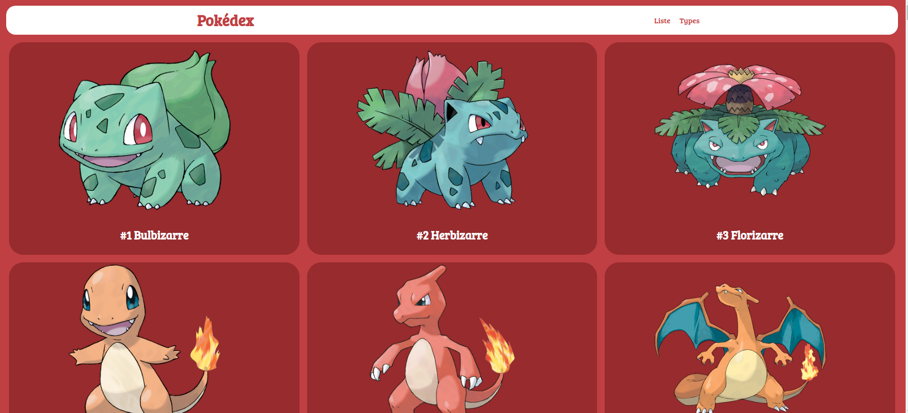
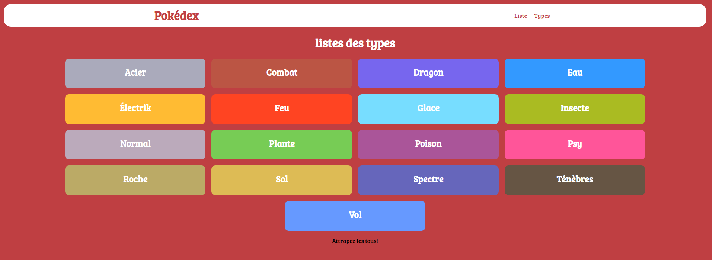
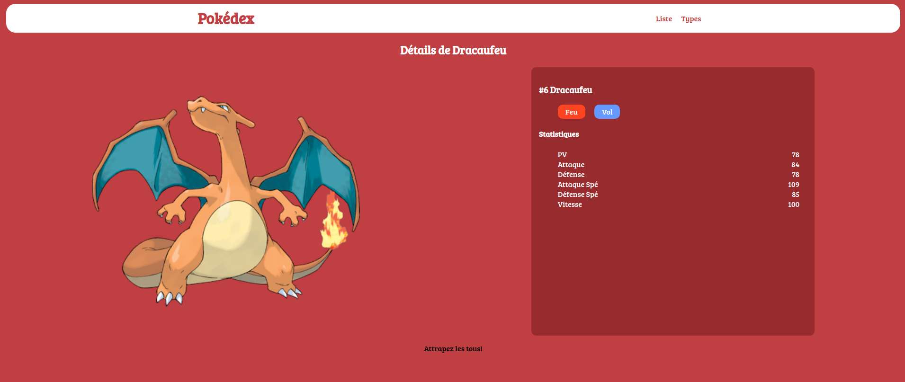

# Pokédex

Petit projet sur un pokédex pour apprendre sur une architecture MVC minimaliste et connexion à la base de données.

## Page d'accueil

## Page types

## Détail d'un pokémon

## Structure de la base de données

